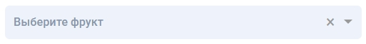
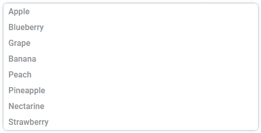

# Компонент "Select"
## Запуск
Загрузите проект. После запустите его с помощью команды __npm start__

## Что включает в себя Компонент "Select"?
Данный компонент состоит из input поля и popup-menu:

## Как работает Компонент "Select"?

1. При клике по инпут полю или по иконке шеврона открывается поп ап меню.
2. При клике по инпут полю или по иконке шеврона можно обратно закрыть поп ап меню
3. Возможно открытие поп ап меню с помощью клавиши "Enter"
4. Возможно открытие поп ап меню с помощью клавиши "Esc"
5. В открывшемся поп ап меню можно выбрать несколько фруктов. После выбора они поместятся в инпут поле.
6. Выбранные фрукты можно удалить нажав на крестик в инпут поле. Инпут поле отчистится.
7. Можно выполнить поиск, вводя значение в инпут поле. Подходящие значения появятся в поп ап меню.

